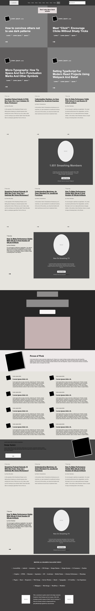

Design-Teardown

# PROJECT: DESIGN TEARDOWN

This project consists of building a heatmap of the Smashing magazine website

## Project Design:

The goal is to make a heatmap of the Smashing magazine website

This landing page is designed using elements aligned with a combination of CSS positioning techniques (float, flex).

## Main sections :

- Navigation; it is designed using flex-box system and covers nav items.

- Main Content; Containing whole layout of main images and articles.

- Footer: It is designed with flex-box system and aligned with related CSS properties.

## Built With :

- HTML
- CSS ( Background & Gradient Properties )

## Live Demo :

[Project Live Link](https://raw.githack.com/ClaytonSiby/Design-Teardown/smashing-magazine-homepage/index.html)

## Authors :

👤 **Clayton Siby**

- Github: [@ClaytonSiby](https://github.com/ClaytonSiby)
- Twitter: [@ClaytonSiby](https://twitter.com/ClaytonSiby)
- Linkedin: [ClaytonSiby](https://www.linkedin.com/in/clayton-siby-48a8a0183/)

👤 **Yiğit Mersin**

- Github: [@yigitm](https://github.com/yigitm)
- Twitter: [@yigitmersin](https://twitter.com/ygtmrsn)
- Linkedin: [ygtmrsn](https://www.linkedin.com/in/yigitmersin)

## 🤝 Contributing :

Contributions, issues and feature requests are welcome!

Feel free to check the [issues page](https://github.com/ClaytonSiby/Design-Teardown/issues).

## Show your support :

Give a ⭐️ if you like this project!

## Acknowledgments :

- Hat tip to Smashing Magazine
- The Odin Project
- Microverse

## 📝 License :

This project is [MIT](https://github.com/yigitm/Apple-Clone/blob/master/LICENSE) licensed.
